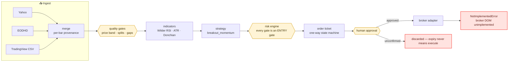
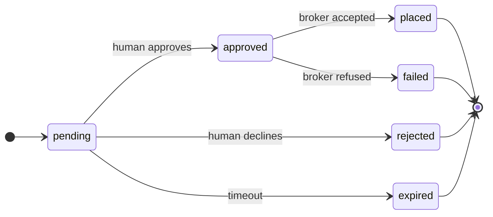

<div align="center">



<p>
  <a href="https://github.com/CodeNKoffee/egx-desk/actions/workflows/ci.yml"></a>
  
  
  
  
  <a href="LICENSE"></a>
  
  
</p>

**A momentum/breakout trading system for the Egyptian Exchange — built to be measured before it is trusted.**

<sub>The Python package inside this repository is <code>egx-trader</code>; the CLI is <code>egx</code>.</sub>

<a href="#-why-it-exists">Why</a> ·
<a href="#-what-the-backtest-says">Backtest</a> ·
<a href="#-how-it-fits-together">Architecture</a> ·
<a href="#-things-this-codebase-learned-the-hard-way">Hard-won lessons</a> ·
<a href="#-design-rules">Rules</a> ·
<a href="#-quickstart">Quickstart</a>

</div>

---

> [!WARNING]
> **Research software, not investment advice.** Backtest results are not predictions.
> Automating a broker account may breach that broker's terms and put the account at
> risk. See [NOTICE.md](NOTICE.md).

> [!IMPORTANT]
> **Nothing in this repository can place an order.** The execution path is deliberately
> unfinished, and the parts that exist are gated behind explicit configuration *and*
> per-order human approval.

<table>
<tr>
<td align="center"><b>96</b><br><sub>instruments</sub></td>
<td align="center"><b>99%</b><br><sub>session coverage<br>(merged feeds)</sub></td>
<td align="center"><b>91</b><br><sub>non-trading days<br>derived, not listed</sub></td>
<td align="center"><b>378</b><br><sub>tests</sub></td>
<td align="center"><b>0</b><br><sub>orders it can place</sub></td>
</tr>
</table>

## 🎯 Why it exists

The system it replaces was a mean-reversion scanner: it emitted BUY only when
`rsi <= 30` or `rsi <= 40`. During a stock's run from ~48 to ~609 EGP, RSI sat in
the 70s–90s and price was far above both moving averages, so every rule fell
through to HOLD. **It was structurally incapable of buying strength** — not a
tuning problem, a property of the rule family.

This targets the opposite: breakout entries with a wide trailing exit. And unlike
its predecessor, it is measured against a cost model that reflects what the market
actually does to an order.

## 📊 What the backtest says

Replaying 2022–2026 on the stock above, 20,000 EGP notional:

| Strategy | Trades | Hit rate | Net |
|:---|---:|---:|---:|
| 🟢 `breakout_momentum` | 8 | 38% | **+19,487 EGP** |
| ⚪ `mean_reversion` (baseline) | 1 | 100% | +7,389 EGP |

The breakout entered the run twice and captured +98% on the second. The baseline
took one trade in four years and was absent throughout.

> [!CAUTION]
> **What that does not show.** The exit gave back a lot — it captured 166→331 and
> missed 331→564, stopped out when a −20.0% limit-down session breached a 3×ATR
> chandelier. And **eight trades on one symbol is a case study, not evidence.** It
> answers *"would this have caught that move?"* It does not answer *"does this make
> money?"*

## 🏗 How it fits together



The chain ends in a wall on purpose. See [Status](#-status).

## 🕰 The trading day

```mermaid
gantt
    title EGX session — Sunday to Thursday, Africa/Cairo
    dateFormat HH:mm
    axisFormat %H:%M
    section Phases
    Pre-open (closes at random, 09:50–10:00)  :done,   po,  09:30, 30m
    Continuous trading                        :active, ct,  10:00, 255m
    Closing auction                           :        ca,  14:15, 10m
    Trading-at-close                          :        tac, 14:25, 5m
```

The pre-open ends at a **random** moment between 09:50 and 10:00 — a deliberate
anti-gaming measure, and a reason no logic here may assume a fixed open. Settlement
is **T+2** by default; T+0 requires an eligible board *and* a broker subscription
*and* an advanced limit order.

## 🔬 Things this codebase learned the hard way

Every one of these was found by running code against the live market. They are the
main reason this repository might be useful to someone else building on EGX.

<details open>
<summary><b>🗓 Egypt's public holidays are not the exchange's holidays</b></summary>

<br>

EGX traded on Police Day and June 30 in 2026 but was closed on both in 2024, and the
Islamic and Coptic observances move annually. Hand-writing the calendar produced two
false holidays and omitted every Eid. It is now *derived from the trading record* — a
date is closed when under 15% of a liquid basket has a bar for it. That found **91
non-trading days against 7 hand-written**, and it matters because a missing holiday
corrupts settlement dates.

</details>

<details>
<summary><b>📉 <code>range=max</code> returns monthly bars</b></summary>

<br>

Yahoo serves them while still reporting `interval=1d`. 10y → 2089 bars at 1-day
spacing; max → 275 at 31-day spacing. Backtesting on those unnoticed would produce
fiction.

</details>

<details>
<summary><b>🕳 Consecutive bars are not consecutive sessions</b></summary>

<br>

Yahoo drops 22–30% of EGX sessions at random, so one bar step can span several days.
Judging that against a single-day price band flagged 296 "corrupt" bars across 59
symbols, nearly all false. The gate now compounds its allowance over sessions
actually elapsed: `allowed = (1 + limit) ** sessions - 1`.

</details>

<details>
<summary><b>🧩 No single feed is sufficient</b></summary>

<br>

| Provider | Session coverage |
|:---|---:|
| Yahoo | 81% |
| EODHD | 92% |
| **Merged** | **99%** |

They miss *different* sessions. Every merged bar carries provenance, because the
feeds disagree on prices and a backtest that cannot say which vendor supplied a bar
cannot distinguish an edge from an artefact.

</details>

<details>
<summary><b>📐 RSI means Wilder's smoothing</b></summary>

<br>

An SMA of gains and losses is a different indicator: after 20 declining bars then 16
rising, the SMA version reads **100** while Wilder reads **69**. A "sell above 70"
rule fires on one and not the other.

</details>

<details>
<summary><b>🚫 TradingView has no data API at any tier</b></summary>

<br>

And its terms forbid automated collection. Even the CDP bridge approach has
`exportData()` blocked. Manual CSV export only, which is why the importer here is a
file reader rather than a client.

</details>

## 🛡 Design rules

These are enforced by tests, and breaking them makes the system **unsafe** rather
than merely wrong.

| Rule | Why |
|:---|:---|
| 🔒 **Unknown never reads as permissive** | No board data → not T+0 eligible. No sourced Sharia label → excluded from the Sharia universe. An unsourced label is not a label. |
| 🚪 **Nothing may block an exit** | Every risk gate is an *entry* gate. A cap that blocks a sell does not reduce risk, it creates it — you would hold a position the software refuses to release. Exits face settlement alone. |
| ⏳ **Expiry never means execute** | An unconfirmed ticket is discarded. "No objection, so proceed" would turn being away from the desk into a trading decision. |
| 🕳 **A missing indicator is missing** | Never zero, never forward-filled. |

The ticket lifecycle encodes the last two — every terminal state is a dead end, and
there is no path backwards:



> Rewinding a ticket is how the same order gets submitted twice, so the state machine
> refuses it and tells you to create a new one.

## 🚀 Quickstart

```bash
uv venv --python 3.12
uv pip install -e ".[dev]"
cp .env.example .env
.venv/bin/pytest
```

`.env` needs at minimum a market-data source. See [`.env.example`](.env.example) for
every option — execution mode, universe mode, providers, risk limits.

## ⌨️ Commands

| Command | What it does |
|:---|:---|
| `egx universe` | instrument master and coverage gaps |
| `egx calendar` | trading days, session phases, T+2 settlement dates |
| `egx data <symbols>` | fetch daily OHLCV and report quality |
| `egx audit` | quality gates across the whole universe |
| `egx verify-calendar` | cross-check holidays against the trading record |
| `egx providers` | which data providers are configured |
| `egx compare-providers` | measure providers against each other on session coverage |
| `egx dashboard` | static HTML snapshot |
| `egx desk` | live dashboard with controls (localhost only) |
| `egx record` | record intraday bars for the session |

## 🗂 Layout

```
src/egx_trader/
├── market_calendar/   session clock, holidays, settlement arithmetic
├── universe/          instrument master: Sharia flag, board, T+0 eligibility
├── data/              OHLCV + quality gates; providers/ and intraday/
├── features/          indicators (Wilder RSI, ATR, Donchian, turnover)
├── strategies/        breakout_momentum | mean_reversion (baseline)
├── backtest/          event-driven engine with the EGX cost model
├── portfolio/         lot-level ledger, cost basis, tax reserve
├── risk/              pre-trade gates, order budget, kill switch
├── execution/         order types, ticket lifecycle, adapters
├── control/           local desk server
├── dashboard/         self-contained HTML
└── notify/            desktop notifications
```

<sub><code>market_calendar</code> rather than <code>calendar</code> — the latter shadows a stdlib module.</sub>

## 📍 Status

| Phase | Scope | State |
|:---:|:---|:---|
| **0** | Config, calendar, universe, data + quality gates | ✅ done |
| **1** | Indicators, strategies, backtest engine | ✅ done |
| **2** | Ledger, risk engine | ✅ done |
| **3** | Ticket lifecycle, adapters | 🟡 partial — broker integration unfinished |
| **4** | Unattended execution | ⬜ not started |

The broker integration is unfinished **on purpose**. Filling an order ticket requires
reading a specific broker's live DOM, and inventing selectors would produce an adapter
that silently clicks the wrong control on a real account. It raises
`NotImplementedError` naming what it needs instead.

## 🤝 Contributing

The tests encode reasoning, not just behaviour — most carry a docstring explaining
which real failure they prevent. **If a test looks arbitrary, that docstring is the
place to check before changing it.**

There is a [`.claude/skills/egx-trading`](.claude/skills/egx-trading/SKILL.md) skill
collecting the domain rules and the gotchas above, so an AI assistant working on this
starts with the context rather than rediscovering it.

## 📄 Licence

MIT — see [LICENSE](LICENSE). [NOTICE.md](NOTICE.md) covers what that means for
software that touches real money.

<div align="center">
<br>
<sub>Built for an exchange that closes at 14:30 and settles two days later.</sub>
</div>
